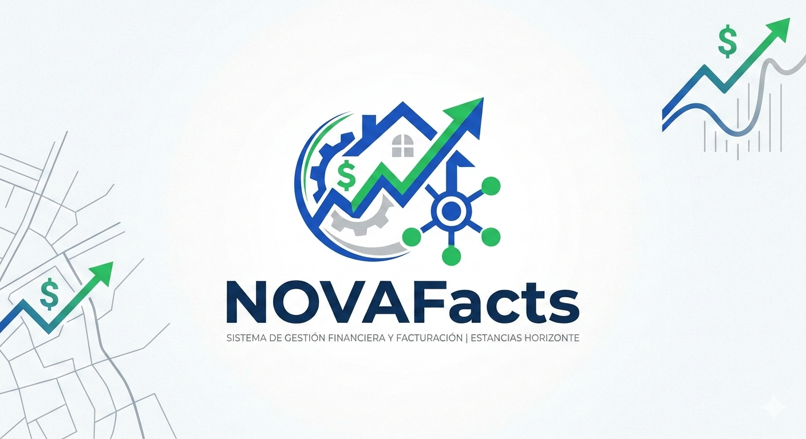

# 🚀 NOVAFACTS

## 💡 Sistema Inteligente de Gestión Financiera para Reservas de Hospedaje

---

## 👥 Grupo de Trabajo

**Nombre del grupo:** (Agregar nombre del grupo aquí)

| Integrante | Correo |
|------------|--------|
| Julián Andrés Foglia Wilches | jfoglia@unal.edu.co |
| Laura Valentina Hernández | lahernandez@unal.edu.co |
| Santiago Cubides | sacubides@unal.edu.co |
| Sebastián Pretel Rey | serey@unal.edu.co |

---

## 📌 Descripción del Proyecto

**NovaFacts** es un sistema diseñado para organizar, automatizar y controlar la gestión financiera asociada a reservas de hospedaje.

El proyecto surge a partir de la necesidad de optimizar los procesos financieros de la empresa ficticia **Estancias Horizonte**, dedicada a la administración de propiedades de corta y media estancia a través de:

- 💻 Plataformas externas (Airbnb, Booking, etc.)
- 📱 Canal directo (sitio web, teléfono y WhatsApp)

Actualmente, la gestión de anticipos, penalidades, cancelaciones, facturación y devoluciones puede implicar procesos manuales, hojas de cálculo y reprocesos administrativos que aumentan el riesgo de errores.

NovaFacts busca centralizar toda esta información en una única plataforma, permitiendo:

- ✅ Control financiero completo por cada reserva  
- ✅ Cálculo automático de penalidades según políticas configuradas  
- ✅ Gestión de anticipos y devoluciones  
- ✅ Trazabilidad total de cada movimiento financiero  
- ✅ Reducción de errores operativos  
- ✅ Mayor control interno y cumplimiento fiscal  

A diferencia de sistemas tradicionales que solo registran facturas, NovaFacts integra reglas de negocio asociadas a cancelaciones y políticas comerciales, garantizando coherencia contable desde la creación de la reserva hasta su cierre financiero.

---

## 🎯 Objetivo del Sistema

El objetivo principal de **NovaFacts** es garantizar que cada reserva tenga un control financiero claro, estructurado y verificable, permitiendo conocer en todo momento:

- Qué se facturó  
- Qué se pagó  
- Qué se debe devolver  
- Qué penalidades aplican  
- Cuál es el impacto contable de cada transacción  

De esta manera, el sistema aporta orden, transparencia y eficiencia a la operación financiera del negocio.

---

## 📄 Propósito del Documento

Este repositorio documenta el proceso de:

- Elicitación de requisitos  
- Análisis funcional  
- Formalización del modelo del sistema  

para el desarrollo de un software a medida enfocado en la gestión financiera y facturación de reservas de hospedaje.

---

## 🏷️ Logo del Proyecto 

```markdown

